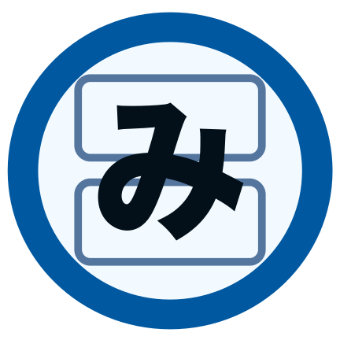

# Mihon DS

### Dual-Screen Fork of Mihon
A specialized fork of [Mihon](https://mihon.app) optimized for devices with secondary physical displays (like the AYN Thor, AYANEO Flip DS, and external monitors). This fork is capable of running side-by-side with the official app.

## Features

*   **Dual Screen Support:** Optimized reading experience that spans across two physical displays.
*   **Side-by-Side Installation:** Uses a unique package name (`app.mihon.ds`) so it can be installed alongside the official Mihon app.
*   **Webtoon Spanning:** Automatically synchronizes scrolling across both screens for a continuous webtoon reading experience.
*   **Customizable Setup:** New onboarding steps to select the target Display ID and rotation overrides.
*   **Privacy Focused:** Telemetry and Crashlytics are disabled by default.

*Plus all the standard features of Mihon:*
*   Local reading of content.
*   A configurable reader with multiple viewers, reading directions and other settings.
*   Tracker support: MyAnimeList, AniList, Kitsu, MangaUpdates, Shikimori, and Bangumi.
*   Categories to organize your library.
*   Light and dark themes.

## Supported Devices

Mihon DS currently supports devices that expose their secondary screen as an external display to Android, including:
*   **AYN Thor**
*   **AYANEO Flip DS**
*   **External Monitors** (via USB-C/HDMI)

*Note: Internally virtualized dual-screen devices (like the Surface Duo) are not currently supported but may be added in the future.*

## Installation & Data Sharing

Mihon DS is designed to coexist with the official Mihon app without conflict.

### Storage & Data Sharing
When you first launch Mihon DS, you will be asked to select a storage folder.
*   **Shared Content:** If you select the **same folder** as your main Mihon app, both apps will share the same **Downloads** and **Backups**. This allows you to read your existing library downloads in either app.
*   **Isolated Databases:** Even if you share the storage folder, the **Library Database** (your list of manga, read progress, and categories) remains separate for each app. You can use the Backup/Restore feature to sync your library between them.

## Contributing

Pull requests are welcome. For major changes, please open an issue first to discuss what you would like to change.

## Disclaimer

This is a fork of the [Mihon Open Source Project](https://github.com/mihonapp/mihon). The developer(s) of this fork do not have any affiliation with the content providers available, and this application hosts zero content.

## License

<pre>
Copyright © 2015 Javier Tomás
Copyright © 2024 Mihon Open Source Project
Copyright © 2024 Mihon DS Contributors

Licensed under the Apache License, Version 2.0 (the "License");
you may not use this file except in compliance with the License.
You may obtain a copy of the License at

http://www.apache.org/licenses/LICENSE-2.0

Unless required by applicable law or agreed to in writing, software
distributed under the License is distributed on an "AS IS" BASIS,
WITHOUT WARRANTIES OR CONDITIONS OF ANY KIND, either express or implied.
See the License for the specific language governing permissions and
limitations under the License.
</pre>

