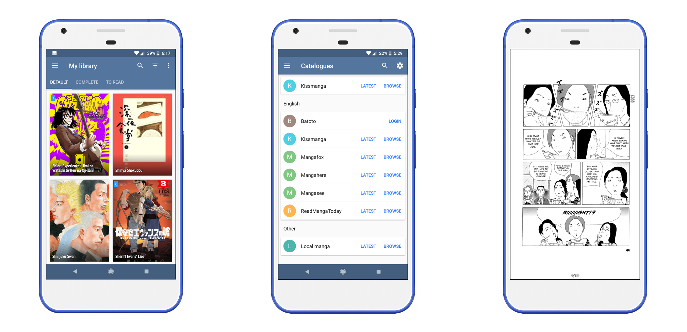

| Build | Stable | Weekly Preview | Contribute | Support Server |
|-------|----------|---------|------------|---------|
|  |  |  |  |  |

# Tachiyomi
Tachiyomi is a free and open source manga reader for Android 6.0 and above.

## Features

Features include:
* Online reading from [a variety of sources](https://github.com/tachiyomiorg/tachiyomi-extensions)
* Local reading of downloaded manga
* A configurable reader with multiple viewers, reading directions and other settings.
* [MyAnimeList](https://myanimelist.net/), [AniList](https://anilist.co/), [Kitsu](https://kitsu.io/), [Shikimori](https://shikimori.one), and [Bangumi](https://bgm.tv/) support
* Categories to organize your library
* Light and dark themes
* Schedule updating your library for new chapters
* Create backups locally to read offline or to your desired cloud service

## Download
Get the app from our [releases page](https://github.com/tachiyomiorg/tachiyomi/releases).

If you want to try new features before they get to the stable release, you can download the preview version [here](https://github.com/tachiyomiorg/android-app-preview/releases).

## Issues, Feature Requests and Contributing

Please make sure to read the full guidelines. Your issue may be closed without warning if you do not.

Issues

1. **Before reporting a new issue, take a look at the [FAQ](https://tachiyomi.org/help/faq/), the [changelog](https://github.com/tachiyomiorg/tachiyomi/releases) and the already opened [issues](https://github.com/tachiyomiorg/tachiyomi/issues).**
2. If you are unsure, ask here: 

Bugs

* Include version (More > About > Version)
 * If not latest, try updating, it may have already been solved
 * Preview version is equal to the number of commits as seen in the main page
* Include steps to reproduce (if not obvious from description)
* Include screenshot (if needed)
* If it could be device-dependent, try reproducing on another device (if possible)
* For large logs use http://pastebin.com/ (or similar)
* Don't group unrelated requests into one issue

DO: https://github.com/tachiyomiorg/tachiyomi/issues/24 https://github.com/tachiyomiorg/tachiyomi/issues/71

DON'T: https://github.com/tachiyomiorg/tachiyomi/issues/75

Feature Requests

* Write a detailed issue, explaining what it should do or how. Avoid writing just "like X app does"
* Include screenshot (if needed)

Source requests should be created at https://github.com/tachiyomiorg/tachiyomi-extensions, they do not belong in this repository.

Contributing

See [CONTRIBUTING.md](./CONTRIBUTING.md).

Code of Conduct

See [CODE_OF_CONDUCT.md](./CODE_OF_CONDUCT.md).

## FAQ

[See our website.](https://tachiyomi.org/)
You can also reach out to us on [Discord](https://discord.gg/tachiyomi).

## License

    Copyright 2015 Javier Tomás

    Licensed under the Apache License, Version 2.0 (the "License");
    you may not use this file except in compliance with the License.
    You may obtain a copy of the License at

    http://www.apache.org/licenses/LICENSE-2.0

    Unless required by applicable law or agreed to in writing, software
    distributed under the License is distributed on an "AS IS" BASIS,
    WITHOUT WARRANTIES OR CONDITIONS OF ANY KIND, either express or implied.
    See the License for the specific language governing permissions and
    limitations under the License.

## Disclaimer

The developer of this application does not have any affiliation with the content providers available.
