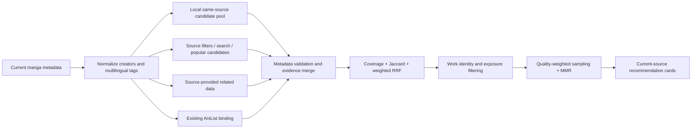

<div align="center">

<a href="https://mihon.app">
  
</a>

# Mihon Author & Manga Recommendations

A source-scoped manga recommendation fork of [Mihon](https://github.com/mihonapp/mihon).

It adds **More by the same creators** and **Similar manga** rows above the chapter list while keeping every recommendation within the source of the manga currently being viewed.

[](https://github.com/mihonapp/mihon)
[](#installation)
[](./LICENSE)
[](https://github.com/komichiakebi74-source/mihon-author-recommendation-ver/releases)

</div>

> [!IMPORTANT]
> This is a personal Mihon fork, not an official Mihon release. The application does not provide, host, or distribute manga. Compatible source extensions must be installed and configured separately.

## Features

- Adds two native horizontal recommendation rows to both phone and tablet manga detail layouts:
  - **More by the same creators** — other works by the author, artist, or a reliably identified group/circle.
  - **Similar manga** — recommendations assembled from tags, source search results, source-provided related data, and existing AniList bindings.
- Keeps every recommendation scoped to the current `sourceId`. Opening a card creates and navigates to the manga through the same source.
- Normalizes Simplified Chinese, Traditional Chinese, English, Japanese, Korean, and mixed-language tags.
- Adapts scoring for manga with very few tags, many tags, mixed scripts, or candidates containing much larger tag sets.
- Uses quality-weighted random sampling and diversity re-ranking to reduce repetitive recommendation sets.
- Uses source-scoped work identities to exclude the current manga, recently visited ancestors, cross-row duplicates, and alias URLs.
- Includes a configurable recommendation keyword filter for titles, creators, tags, and descriptions.
- Loads recommendations independently from manga details and chapters. Covers continue to use Mihon's native asynchronous image loading and cache.
- Hides an individual row when the source does not expose enough reliable evidence, without showing loading, error, or retry placeholders.

## Usage Demo

1. Install the APK and complete Mihon's normal storage and source-extension setup.
2. Open a manga from any configured source.
3. After its metadata is available, supported recommendation rows appear above the chapter list:

```text
Cover, title, creators, and description
Tags

More by the same creators
[cover] [cover] [cover] [cover]  → horizontal scrolling

Similar manga
[cover] [cover] [cover] [cover]  → horizontal scrolling

Chapter list
```

4. Select a recommendation to open it through the source of the current manga. A same-named entry from another source is never substituted.
5. Re-entering or refreshing the page starts a new quality-weighted sample. When enough candidates are available, recently unseen works are preferred.

The recommendation keyword filter is available under:

```text
More → Settings → Library → Recommendations → Filter recommendation keywords
```

Separate multiple terms with commas or new lines. Matching is case-insensitive:

```text
AI, AI-generated, AI生成, 3D
```

## How It Works

The recommendation pipeline is divided into candidate generation, evidence validation, scoring, identity filtering, and diversity-aware sampling:


```mermaid
flowchart LR
    A["Current manga metadata"] --> B["Normalize creators and multilingual tags"]
    B --> C["Local same-source candidate pool"]
    B --> D["Source filters / search / popular candidates"]
    B --> E["Source-provided related data"]
    B --> F["Existing AniList binding"]
    C --> G["Metadata validation and evidence merge"]
    D --> G
    E --> G
    F --> G
    G --> H["Coverage + Jaccard + weighted RRF"]
    H --> I["Work identity and exposure filtering"]
    I --> J["Quality-weighted sampling + MMR"]
    J --> K["Current-source recommendation cards"]
```

### Candidate generation

Candidates are always generated within the current source boundary. The repository first reads locally known manga metadata for the same source, then selects from the source's structured filters, text search, or popular list according to the capabilities exposed by the extension. Popular results only expand the candidate pool; popularity alone is never treated as proof of similarity.

AniList community recommendations are used only when the current manga already has an AniList track binding. Its existing `remoteId` is queried, and every external result must then be mapped and validated against the current source. Titles are not sent to AniList for unbound manga.

Reliable source-provided related data is treated as strong evidence. nHentai has a one-request related fast path that shares host-level pacing, cooldown, and backoff state. If that endpoint is unavailable, the repository can fall back to the generic same-source route.

### Creator matching

Author, artist, and explicitly labeled group/circle names are normalized with Unicode NFKC, stable case handling, and whitespace normalization before exact intersection matching. Groups are recognized only from explicit metadata or prefixes; ordinary description text is not scanned to guess a group.

When a search result lacks creator metadata, the repository may fetch details within its request budget and validate the result. An item that cannot be confirmed as sharing a creator is not allowed into the creator row.

### Multilingual tags and scoring

Tags are mapped to internal semantic identities instead of comparing display strings directly. Known aliases such as `爱情`, `愛情`, `恋愛`, and `romance` can therefore participate in the same comparison. Unknown tags are retained conservatively as source-native identities, so compatibility does not depend on every source using a fixed vocabulary.

Up to four core tags are selected for the target manga, while remaining tags provide secondary evidence. Content scoring is driven mainly by target-core-tag coverage and also considers core-tag Jaccard overlap and secondary-tag matches. A candidate with many extra tags is therefore not unfairly penalized simply for having a larger tag set.

Evidence from multiple routes is merged using weighted reciprocal rank fusion (RRF). Candidates below the quality threshold never enter the random pool.

When the target has no reliable tags, only strong evidence such as AniList recommendations or source-provided related data can qualify. Generic popular items are not presented as similar manga.

### Identity, deduplication, and quality-aware randomness

A work identity contains its `sourceId`, canonical URL, exact and conservative base titles, creators, cover, and explicit series information. URL normalization preserves query parameters that identify a work and removes only common tracking parameters. Identical URLs or titles under different sources remain different works.

After the quality gate, candidates are sampled without replacement using `SecureRandom` and quality-derived weights. Maximal marginal relevance (MMR) reduces tag redundancy between already selected cards, while source-scoped exposure history gives recently unseen candidates priority. Randomness changes the composition of the qualified set; it does not allow low-quality items to bypass validation.

### Performance and request protection

- Recommendation work is independent of chapter loading and can publish progressively.
- Generic sources use at most two concurrent recommendation requests and have soft and hard deadlines.
- Rate-sensitive sources use a smaller request budget, serialized requests, and a minimum interval between calls.
- HTTP 429 responses are not immediately retried. `Retry-After` is honored when present; otherwise exponential backoff with jitter is applied.
- Leaving the page, switching manga, or repeatedly refreshing cancels stale work so an old page cannot overwrite the new page's rows.
- Detail metadata uses a bounded cache, while candidates and exposure history remain source-scoped.

## Source Compatibility

Recommendation count, latency, and quality depend on the metadata and search capabilities exposed by each source extension.

| Source capability | More by the same creators | Similar manga |
| --- | --- | --- |
| Complete creators and tags with filters or search | Supported | Supported |
| Only a few reliable tags | Depends on creator metadata | Uses target-coverage-aware retrieval |
| Many or mixed-language tags | Depends on creator metadata | Selects and normalizes core tags before scoring |
| Reliable source-provided related data | Depends on creator metadata | Preferred as strong evidence |
| No creators, tags, or related capability | Hidden | Hidden |
| Local, stub, or non-searchable source | Usually hidden | Shown only when reliable local evidence exists |

## Installation

Download the latest APK from [Releases](https://github.com/komichiakebi74-source/mihon-author-recommendation-ver/releases).

- Requires Android 8.0 or newer.
- Current test builds use the Android debug certificate and the package name `app.mihon.dev`.
- A debug build can be installed alongside official Mihon, but it cannot replace the official `app.mihon` package.
- APKs distributed outside this repository are not guaranteed to correspond to this source tree.

## Building from Source

Android Studio, the Android SDK, and the JDK required by the project must be installed. Clone the repository and use the Gradle Wrapper:

```bash
./gradlew :app:assembleDebug
```

On Windows PowerShell:

```powershell
.\gradlew.bat :app:assembleDebug --no-daemon
```

Before submitting changes, run the relevant checks:

```powershell
.\gradlew.bat spotlessCheck testDebugUnitTest verifySqlDelightMigration lintDebug --no-daemon
```

See Mihon's upstream [contributing guide](./CONTRIBUTING.md) for the full development environment and contribution conventions.

## Known Limitations

- Mihon's public Source API has no universal recommendations endpoint and does not guarantee creator, group, or structured-tag metadata. Both rows therefore cannot be guaranteed for every manga.
- Initial cards can be published quickly, but real latency still depends on the extension, source server, network conditions, and rate limits.
- The nHentai related route relies on a degradable, unofficial endpoint. Failures fall back when possible, while HTTP 429 responses trigger a cooldown to avoid repeatedly hitting the service.
- Multilingual aliases cover common semantics but cannot anticipate every private source vocabulary. Unknown formats are handled conservatively.
- Recommendations use source-visible metadata and existing user bindings. Library or reading-history data is not uploaded to train an external recommendation model.

## Upstream and Contributions

This project is based on [mihonapp/mihon](https://github.com/mihonapp/mihon). The generic recommendation infrastructure, UI, and source-specific adapters currently live in one fork. Before proposing the work upstream, it should be split into smaller independently reviewable changes, with source-specific capabilities abstracted behind optional interfaces or moved to the extension side.

Reproducible bug reports are welcome. A useful recommendation report includes:

- Source name and extension version.
- The current manga URL, when it is safe to share.
- Creator and tag metadata shown by the source.
- A screenshot of the actual result and a description of the expected result.
- Any observed HTTP 429, timeout, or source-search failure.

Do not include account cookies, access tokens, or other login credentials in an issue.

## Disclaimer

This application and its maintainers are not affiliated with any content provider. The application hosts no content. Users are responsible for complying with applicable laws and the terms of service of their content sources.

## License

```text
Copyright © 2015 Javier Tomás
Copyright © 2024 Mihon Open Source Project

Licensed under the Apache License, Version 2.0 (the "License");
you may not use this file except in compliance with the License.
You may obtain a copy of the License at

http://www.apache.org/licenses/LICENSE-2.0

Unless required by applicable law or agreed to in writing, software
distributed under the License is distributed on an "AS IS" BASIS,
WITHOUT WARRANTIES OR CONDITIONS OF ANY KIND, either express or implied.
See the License for the specific language governing permissions and
limitations under the License.
```

See [LICENSE](./LICENSE) for the complete license text.
