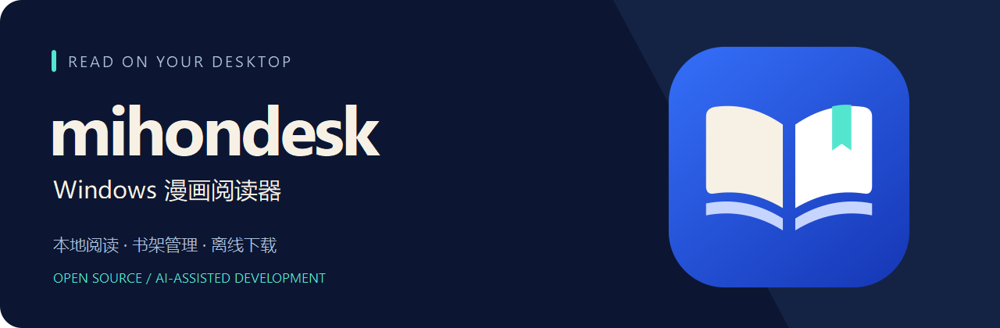

# mihondesk

**从书架到每一页，在 Windows 上阅读漫画。**

AI 辅助开发的开源项目 · 基于 Mihon · Kotlin / Compose Desktop

**[下载 Windows 版](https://github.com/1873412297-art/mihondesk/releases/latest)** · [更新日志](CHANGELOG.md) · [使用说明](docs/WINDOWS_RELEASE.md) · [反馈问题](https://github.com/1873412297-art/mihondesk/issues/new/choose)

**AI 项目说明**：本仓库的 Windows 移植、功能迭代、问题修复和文档维护使用 AI 编程助手协助完成。上游 Mihon、Suwayomi 及其他第三方项目的贡献与许可归属见文末。

## 下载与安装

当前版本：**0.2.13**。面向 **Windows 10 22H2 / Windows 11，x64**，发行包已内置运行环境，无需另装 Java。

程序、安装包和快捷方式现已统一命名为 **mihondesk**。安装版继续使用原有数据目录，支持从 MihonW 升级。

| 下载 | 适用方式 |
| --- | --- |
| **[EXE 安装包](https://github.com/1873412297-art/mihondesk/releases/download/v0.2.13/mihondesk-0.2.13.exe)** | 推荐使用，下载后按向导安装 |
| [MSI 安装包](https://github.com/1873412297-art/mihondesk/releases/download/v0.2.13/mihondesk-0.2.13.msi) | 需要 MSI 安装方式时使用 |
| [便携 ZIP](https://github.com/1873412297-art/mihondesk/releases/download/v0.2.13/mihondesk-0.2.13-windows-x64-portable.zip) | 完整解压到可写目录，运行其中的 `mihondesk.exe` |
| [SHA-256 校验文件](https://github.com/1873412297-art/mihondesk/releases/download/v0.2.13/SHA256SUMS.txt) | 校验下载文件的完整性 |

**首次使用**：发行包不预装在线图源或扩展仓库，请自行添加仓库或安装扩展。本地文件阅读无需安装图源。升级会保留已有书架、设置和阅读数据。

安装版默认将数据保存在 `%APPDATA%\MihonW`；便携版保存在 `mihondesk.exe` 同目录下的 `data` 文件夹。迁移便携版时请一并保留该文件夹。

## 可以做什么

| 功能 | 说明 |
| --- | --- |
| 本地阅读 | 导入图片目录，以及 ZIP / CBZ、RAR / CBR、7z / CB7、TAR 和图片型 EPUB 等文件 |
| 桌面阅读器 | 单页、双页、纵向和条漫模式，阅读方向切换、缩放、键盘与鼠标操作；阅读中直达书籍详情 |
| 书架管理 | 分类、搜索、阅读进度和历史；在线漫画通过明确的加入书架操作收藏 |
| 图源浏览 | 安装扩展，浏览、搜索漫画并查看章节；支持部分 Mihon / Tachiyomi 扩展的转换与兼容运行 |
| 离线与更新 | 章节下载、下载队列恢复、从下载页直接阅读已完成内容，以及书库章节更新 |
| 备份与恢复 | 导入、导出 Mihon 兼容备份；具体字段支持范围见下方兼容说明 |

## 开始使用

1. **安装或解压程序**，运行 `mihondesk.exe`。
2. **阅读本地文件**：使用本地导入入口选择漫画文件或图片目录。
3. **阅读在线内容**：在浏览页安装扩展包，再选择图源。安装入口支持 `.mext`，也可尝试转换受支持的扩展 `.apk`。
4. **保留阅读数据**：使用备份功能定期导出。备份不包含已下载的漫画图片。

## 0.2.13 更新

- 修复下载队列与本地文件状态不同步、离线章节丢失后的重试，以及特定图源图片 CDN 跳转被拒绝的问题。
- 支持选择下载目录，设置页展示当前使用路径。
- 修复深色与纯黑主题下阅读器工具栏、更新日历文字不清楚的问题。
- 补齐阅读器、章节筛选、下载提示、应用锁和扩展管理的中文，统一简繁体用词与日期格式。

详见[本版发布说明](https://github.com/1873412297-art/mihondesk/releases/tag/v0.2.13)和[更新日志](CHANGELOG.md)。

## 当前限制

mihondesk 仍在持续开发，桌面端尚未覆盖 Mihon 的全部功能。

- **扩展兼容性因图源而异**：扩展通过桌面兼容层运行；能够安装或加载，并不代表该图源的所有功能都可用。
- **网站验证与封锁**：登录或验证可以使用程序提供的网页入口；能否通过取决于网站。网站返回 403 或其他访问限制时，可能仍无法读取内容。
- **旧版本升级**：0.2.4 及更早版本的内置更新检查指向旧仓库，首次升级请从[本仓库 Releases](https://github.com/1873412297-art/mihondesk/releases/latest)手动下载。
- **备份与跟踪服务**：部分设置不会迁移，生产账户的完整登录与同步流程仍需继续验证。请查看[备份兼容范围](docs/superpowers/evidence/suwayomi-backup-compatibility.md)和[功能覆盖说明](docs/superpowers/evidence/suwayomi-feature-coverage.md)。

## 反馈与开发

遇到问题请在[本仓库 Issues](https://github.com/1873412297-art/mihondesk/issues)反馈，附上 mihondesk 版本、Windows 版本、复现步骤和错误信息。图源问题请同时提供扩展名称及版本。

欢迎提交改进，参见[贡献指南](CONTRIBUTING.md)。开发资料：

- [扩展兼容矩阵](docs/suwayomi-extension-compatibility.md)
- [功能覆盖与验证范围](docs/superpowers/evidence/suwayomi-feature-coverage.md)
- [Windows 发行与升级说明](docs/WINDOWS_RELEASE.md)
- [开发环境与构建](docs/windows-development.md)
- [图标与品牌资源](docs/BRANDING.md)

## 上游与许可

本项目是 [Mihon](https://github.com/mihonapp/mihon) 的独立 Windows 移植项目，基于其阅读与备份相关实现，并参考 [Suwayomi-Server](https://github.com/Suwayomi/Suwayomi-Server) 的扩展兼容与后台服务实现。感谢上游项目及所有贡献者。Android 原版请访问 [Mihon 官网](https://mihon.app)。

项目采用 [Apache License 2.0](LICENSE)。桌面端第三方组件及许可见 [THIRD-PARTY-DESKTOP.txt](THIRD-PARTY-DESKTOP.txt)。程序本身不提供或托管漫画内容。

Copyright © 2015 Javier Tomás

Copyright © 2024 Mihon Open Source Project
